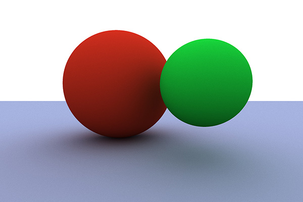

# KTracer
## A Ray Tracer written in Kotlin

### Motivation
I'm building this project during my batch at the [Recurse Center](https://www.recurse.com). I wanted to code a ray tracer after having a chat with @Trbabb. I had a good amount of help from him, and great explanations about physics involved in computer graphics. That was the main motivation behind building this project.

I chose Kotlin for many reasons. I learned how to code with Java, and I wanted to give Kotlin a try since I first heard about it. I discarded working with Python due to its performance. I also discarded JavaScript because I wanted to use a language where I could use operator overloading, as I knew I will have to use a good amount of vector algebra. I considered using C++, as this would allow me to use part of @Trbabb code, although I wanted to see if I could build a ray tracer from scratch. For those reasons Kotlin looked like a good choice for this project

### How it works
The main idea of a ray tracer is to simulate how a lens works. In real life, photons come from light source, bounce in the scene, and then some of them reach the sensor. Computing those photons would be extremely expensive, as only a small fraction of them would eventually reach the sensor.

Using ray tracing we try to find lights in the direction opposite to the one in real life. To do so, I define the focal point, which I call the `Camera`. I also define a `Sensor`, that is just a matrix of `Pixel`s. I also have a `Scene`, which is an `ArrayList<Object>`, where `Object` is anything that can be rendered, both light absorbing and light emitting objects.

The main loop of the algorithms consists in:
```
For each `pixel` in the `Sensor`:
  1. Compute the ray that goes from the `lens` to that `pixel`
  2. Iterate over the `Scene` objects to find which ones I hit.
  3. Keep the closest one, visible from the lens (discard negative distances)
  4. Store the information of that hit (object, direction, distance, material,...)
  5. If the `Object` hit was a light, this is what we have in the `pixel`.
  6. If the `Object` hit was light-absorbent, we need to recurse to see the light that hits that object
    6.1. Generate a random direction vector going out of the hit surface
    6.2. Go back to (2.): Trace the `Scene` again, keeping the closest one, and storing the hit information
```

As you can imagine, this can iterate so many times. At the same time, every time that a light hit an object, part of the light is absorbed, so as we recurse deeper, the contribution of that light to the color of the pixel gets smaller. Make sense to set a threshold where we would return 0, as if this specific ray didn't reach any light source. So far this threshold is set to depth 10, but in the future I will use the amount of "remaining light" to break the loop.

Another optimization in speed that this algorithm has over the real light, is that, at step 6.1, we generate a random vector to see what light is contributing to the color of that object. If we wanted to make the algorithm behave closer to the real world, when we hit an object with the initial ray (crossing a pixel), we should generate enough rays to cover a representative amount of space. This is going to give us an exponential complexity, and solving an NP problem doesn't look like the best approach to render a scene. The way I solve this problem is doing the main loop a fixed amount of times, each time the random vectors will produce a different color in a given pixel. Then, by keeping the average of those colors, I can get a very good approximation to the real color I would expect to see in that pixel. In the future, I will set the maximum amount of iterations per pixel, but if the color of a pixel doesn't change _much_ in _a few_ iterations, I won't keep computing the color of that pixel assuming that I've already found the representative contribution of lights that affect the color of that pixel. How much is _a few_ times and how much is _much_ change is something that I'll have to define after experimenting with different scenes.

### Features
There are a few of features already implemented.
 * Materials with light-diffusion  
   
 * Materials with light-reflection  
   
 * Materials with light-refraction  
   
 * Movable camera
 * Frames renderer
 * Depth of field  
   
 * Some rendering performance optimization

### Work in progress
So far I've implemented some features. However, I want to add a few things:
 * Better rendering performance optimization
 * Directional light
 * Support for other shapes
